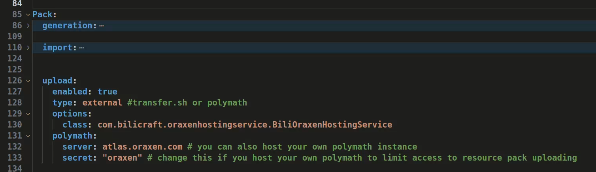

# OraxenHostingService
## 1. 简介
Oraxen资源包自定义托管服务，目前支持123云盘和腾讯云对象存储服务。

## 2. 插件配置
### 2.1 pan.parent-file-id 配置项配置方法
登录[123云盘网页端](https://www.123pan.com/)后，进入资源包上传路径，查看网页链接的`homeFilePath`变量，如下图所示：

文件夹id和`homeFilePath`变量的数字一一对应。上图中，如果要把资源包保存到`/pack/bc/`，配置项`parent-file-id`应填`8187024`。

**使用123云盘存放资源包时，务必开启对应文件夹的直链空间功能！！！**

其他请查看配置文件内注释。
### 2.2 oraxen配置
1. 在`settings.xml`中插入新配置项`Pack.upload.options.class`，填入材质包托管服务类路径`com.bilicraft.oraxenhostingservice.BiliOraxenHostingService`。
2. 修改`settings.xml/Pack.upload.type`为`external`。

## 3. 指令
| 指令          | 功能     | 权限                 |
|-------------|--------|--------------------|
| /ohs reload | 重载配置文件 | ohs.command.reload |
---
**注意：如果在配置文件中改变了资源包的存储位置，在`/ohs reload`后，还要使用`/o reload pack`或`/o reload all`重新上传资源包。**