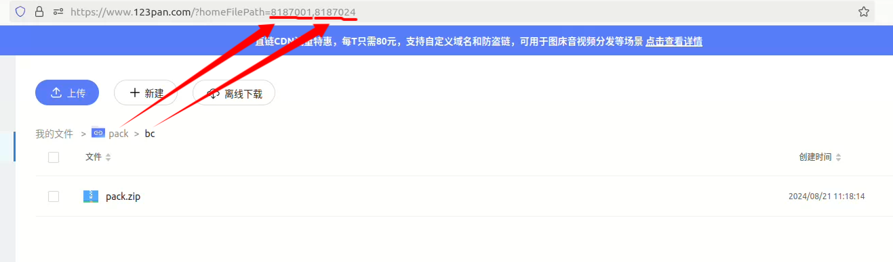
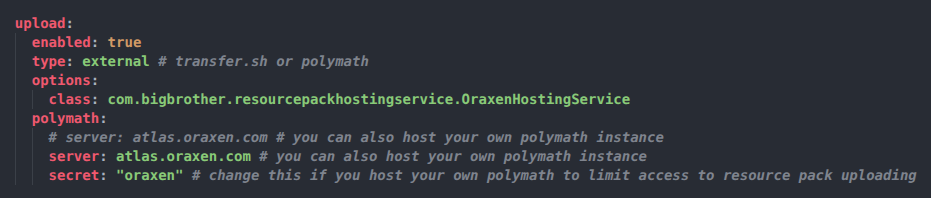

# ResourceHostingService

## 1. 简介

资源包自定义托管服务，支持Oraxen插件。存储平台支持123云盘、腾讯云对象存储服务、Cloudflare R2对象存储服务。
可以同时开启多个服务，玩家加入游戏请求资源包时，如果请求第一个存储服务失败后，会请求下一个存储服务，以此类推。
配置文件中的顺序决定请求顺序。

## 2. 插件配置

### 2.1 pan.parent-file-id 配置项配置方法

登录[123云盘网页端](https://www.123pan.com/)后，进入资源包上传路径，查看网页链接的`homeFilePath`变量，如下图所示：

文件夹id和`homeFilePath`变量的数字一一对应。上图中，如果要把资源包保存到`/pack/bc/`，配置项`parent-file-id`应填`8187024`。

**使用123云盘存放资源包时，务必开启对应文件夹的直链空间功能！！！**

腾讯云对象存储服务、Cloudflare R2对象存储服务的配置方法类似，请查看配置文件内注释。

### 2.2 oraxen配置

1. 在`settings.xml`中插入新配置项`Pack.upload.options.class`，填入材质包托管服务类路径`com.bigbrother.resourcepackhostingservice.OraxenHostingService`。
2. 修改`settings.xml/Pack.upload.type`为`external`。
   

## 3. 指令

| 指令           | 功能     | 权限                  |
|--------------|--------|---------------------|
| /rphs reload | 重载配置文件 | rphs.command.reload |

---
> 注意：如果在配置文件中改变了资源包在存储平台的存储位置，在`/rphs reload`后，还要使用资源包插件重新上传资源包。
> 
> Oraxen使用`/o reload pack`或`/o reload all`重新上传资源包。